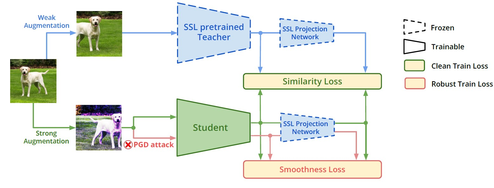

# ProFeAT: Projected Feature Adversarial Training for Self-Supervised Learning of Robust Representations
This repository contains the implementation for the TMLR'24 paper titled "ProFeAT: Projected Feature Adversarial Training for Self-Supervised Learning of Robust Representations". [[openreview](https://openreview.net/forum?id=AUC0Kmn70N)] [[arxiv](https://arxiv.org/abs/2406.05796)]



# Requirements
- Python 3.8
- PyTorch 1.9.0
- wandb
- auto-attack (https://github.com/fra31/auto-attack)

# SSL-AT Training
## ProFeAT
To train the proposed approach, please refer to `pretraining.py`. To start a run, please refer to the `train.sh` script which by default has the reported training hyperparameters for WRN34-10 CIFAR100 setting. If the flag `--linear_eval` is provided, then post training, the code will automatically perform simple linear finetuning (SLF), save the linear checkpoint, and then evaluate metrics like Clean, PGD20 and GAMA accuracies (not auto-attack).


## DeACL
To train the baseline approach (DeACL), please refer to `pretraining_deacl.py` and the script `train_deacl.sh` on how to start the run. Rest of the workflow is the same (finetuning + evaluation).

# Finetuning
In case one would like to perform finetuning separately post training, they can do so using the `finetune.sh` script which calls `finetune.py` with relevant hyper-parameters. Once the finetuned checkpoint is saved, as mentioned earlier, this code evalutes the model on clean, PGD20 and GAMA accuracy.

# Evaluation
Once a finetuned checkpoint is available, one could perform AutoAttack (AA) evaluation (see `aa_eval.sh` and `autoattack_eval.py`) or GAMA evaluation (see `gama_eval.py` and at the end of `finetune.py` on how to evaluate against the GAMA attack)

# Acknowledgement
This codebase borrows code from [AdvCL official repository](https://github.com/LijieFan/AdvCL/tree/main) which is MIT Licensed.

# License
This source code is released under the MIT license found in the `LICENSE` file.

# Citing this work
```
@article{
addepalli2024profeat,
title={ProFeAT: Projected Feature Adversarial Training for Self-Supervised Learning of Robust Representations},
author={Sravanti Addepalli and Priyam Dey and R. Venkatesh Babu},
journal={Transactions on Machine Learning Research},
year={2024},
url={https://openreview.net/forum?id=AUC0Kmn70N},
}
```